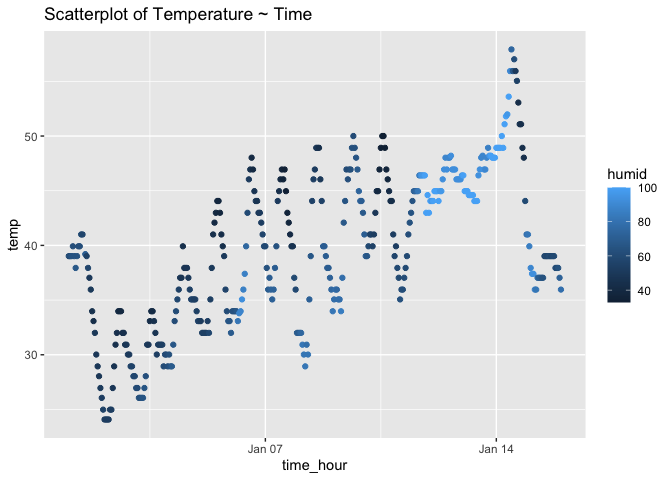

P8105_HW1_lz2950
================
Lehan Zou
2023-09-21

### load necessary packages

``` r
library("moderndive")
library("tidyverse")
```

    ## ── Attaching packages ─────────────────────────────────────── tidyverse 1.3.2 ──
    ## ✔ ggplot2 3.3.6      ✔ purrr   0.3.5 
    ## ✔ tibble  3.1.8      ✔ dplyr   1.0.10
    ## ✔ tidyr   1.2.1      ✔ stringr 1.4.1 
    ## ✔ readr   2.1.3      ✔ forcats 0.5.2 
    ## ── Conflicts ────────────────────────────────────────── tidyverse_conflicts() ──
    ## ✖ dplyr::filter() masks stats::filter()
    ## ✖ dplyr::lag()    masks stats::lag()

``` r
library("ggplot2")
library("tidyverse")
```

## Problem 1

``` r
#load dataset "early_january_weather"
data("early_january_weather")
summary(early_january_weather)
```

    ##     origin               year          month        day              hour      
    ##  Length:358         Min.   :2013   Min.   :1   Min.   : 1.000   Min.   : 0.00  
    ##  Class :character   1st Qu.:2013   1st Qu.:1   1st Qu.: 4.000   1st Qu.: 6.00  
    ##  Mode  :character   Median :2013   Median :1   Median : 8.000   Median :11.50  
    ##                     Mean   :2013   Mean   :1   Mean   : 8.039   Mean   :11.53  
    ##                     3rd Qu.:2013   3rd Qu.:1   3rd Qu.:12.000   3rd Qu.:17.75  
    ##                     Max.   :2013   Max.   :1   Max.   :15.000   Max.   :23.00  
    ##                                                                                
    ##       temp            dewp           humid           wind_dir    
    ##  Min.   :24.08   Min.   : 8.96   Min.   : 32.86   Min.   :  0.0  
    ##  1st Qu.:33.98   1st Qu.:19.94   1st Qu.: 51.34   1st Qu.:140.0  
    ##  Median :39.02   Median :26.06   Median : 61.67   Median :240.0  
    ##  Mean   :39.58   Mean   :28.06   Mean   : 65.48   Mean   :208.2  
    ##  3rd Qu.:44.96   3rd Qu.:35.06   3rd Qu.: 78.68   3rd Qu.:290.0  
    ##  Max.   :57.92   Max.   :53.06   Max.   :100.00   Max.   :360.0  
    ##                                                   NA's   :5      
    ##    wind_speed       wind_gust         precip            pressure   
    ##  Min.   : 0.000   Min.   :16.11   Min.   :0.000000   Min.   :1011  
    ##  1st Qu.: 5.754   1st Qu.:19.56   1st Qu.:0.000000   1st Qu.:1018  
    ##  Median : 8.055   Median :21.86   Median :0.000000   Median :1022  
    ##  Mean   : 8.226   Mean   :22.53   Mean   :0.002039   Mean   :1023  
    ##  3rd Qu.:11.508   3rd Qu.:25.32   3rd Qu.:0.000000   3rd Qu.:1027  
    ##  Max.   :24.166   Max.   :31.07   Max.   :0.190000   Max.   :1034  
    ##                   NA's   :308                        NA's   :38    
    ##      visib          time_hour                     
    ##  Min.   : 0.120   Min.   :2013-01-01 01:00:00.00  
    ##  1st Qu.: 9.000   1st Qu.:2013-01-04 19:15:00.00  
    ##  Median :10.000   Median :2013-01-08 12:30:00.00  
    ##  Mean   : 8.515   Mean   :2013-01-08 12:28:09.39  
    ##  3rd Qu.:10.000   3rd Qu.:2013-01-12 05:45:00.00  
    ##  Max.   :10.000   Max.   :2013-01-15 23:00:00.00  
    ## 

This data set contains 15 variables: origin, year, month, day, hour,
temp, dewp, humid, wind_dir, wind_speed, wind_gust, precip, pressure,
visib, time_hour. Since humidity and temperature are going to be
specified below, I consider those two to be important variables. For
temperature, the `min`, `max`, `median` values are 24.08, 57.92, 39.02;
For humidity, the `min`, `max`, `median` values are 32.86, 100, 61.67.

- size of the data set The data set has 358 rows and 15 columns.

- mean temperature The mean temperature of this data set is
  `mean(early_january_weather$temp)`.

- plot

``` r
#using ggplot to make scatter plot, define x,y variables and color
ggplot(early_january_weather, aes(time_hour, temp, color = humid)) + 
  geom_point()+
  labs(title = "Scatterplot of Temperature ~ Time")
```

<!-- -->

``` r
#save image
ggsave("hw1_scatterplot.png")
```

    ## Saving 7 x 5 in image

From the scatter plot, the temperature fluctuates within days but the
overall trend is increasing.The humidity is relatively steady but
increases between Jan 12 to Jan 14. And it drop back on Jan 14. Also
matches the highest temperature over this time period.

### Problem 2

Create a data frame comprised of:

- a random sample of size 10 from a standard Normal distribution  
- a logical vector indicating whether elements of the sample are greater
  than 0  
- a character vector consisting of the sample converted to character  
- a factor vector measuring the value of the sample

``` r
#define vectors
random_sample <- rnorm(10)
logical_vec <- random_sample > 0
character_vec <- as.character(random_sample)
factor_vec <- factor(rep(c("Level 1", "Level 2", "Level 3"), length.out = 10)) 
```

``` r
#Combine those vectors to a data frame
data_frame <- data.frame(RandomSample = random_sample, LogicalVector = logical_vec, CharacterVector = character_vec, FactorVector = factor_vec)
#show the data frame
data_frame
```

    ##    RandomSample LogicalVector    CharacterVector FactorVector
    ## 1    -0.8027591         FALSE -0.802759054944344      Level 1
    ## 2    -0.4601716         FALSE -0.460171558503364      Level 2
    ## 3    -1.9517992         FALSE  -1.95179922911738      Level 3
    ## 4    -1.4888738         FALSE  -1.48887379407512      Level 1
    ## 5     0.4391993          TRUE    0.4391993473091      Level 2
    ## 6    -1.3718367         FALSE  -1.37183670277856      Level 3
    ## 7    -0.5448130         FALSE -0.544813030788258      Level 1
    ## 8     1.2636418          TRUE   1.26364183334397      Level 2
    ## 9     0.6204412          TRUE  0.620441166815612      Level 3
    ## 10    0.6104551          TRUE  0.610455128853251      Level 1

- calculate mean

``` r
for(variable in variable.names(data_frame))
  print(paste("The mean for variable '", variable, "' is ", data_frame %>% pull(variable) %>% mean, ".", sep = ""))
```

    ## [1] "The mean for variable 'RandomSample' is -0.368651589388508."
    ## [1] "The mean for variable 'LogicalVector' is 0.4."

    ## Warning in mean.default(.): argument is not numeric or logical: returning NA

    ## [1] "The mean for variable 'CharacterVector' is NA."

    ## Warning in mean.default(.): argument is not numeric or logical: returning NA

    ## [1] "The mean for variable 'FactorVector' is NA."

This shows it works for the numeric and logical vectors while character
vector and factor vector are NA values.

``` r
# Convert logical, character, and factor variables to numeric
numeric_logical <- as.numeric(data_frame$LogicalVector)
numeric_logical
```

    ##  [1] 0 0 0 0 1 0 0 1 1 1

``` r
numeric_character <- as.numeric(data_frame$CharacterVector)
numeric_character
```

    ##  [1] -0.8027591 -0.4601716 -1.9517992 -1.4888738  0.4391993 -1.3718367
    ##  [7] -0.5448130  1.2636418  0.6204412  0.6104551

``` r
numeric_factor <- as.numeric(data_frame$FactorVector)
numeric_factor
```

    ##  [1] 1 2 3 1 2 3 1 2 3 1

All of the vectors got the mean result after convert to numerical
variables. This indicate for mean() function, logical vector can be
converted by default while character vector and factor vector are not.
